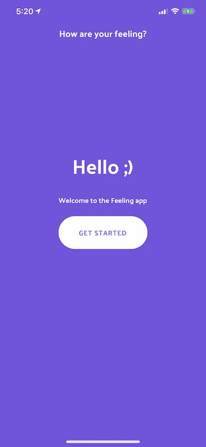

# react-native-feeling

<p align="center">
  <a href="https://github.com/cleandersonlobo/megahack-globo-space/">
    
  </a>
</p>
  <h2 align="center">
   <b>Feeling</b>
  </h2>
  <p align="center">
  <b>Feeling App - How are you feeling?</b>
  </p>
  <p align="center">
  Share your emotion and intensity of your feelings
  </p>

## Libraries and tools

* TypeScript
* [Reanimated](https://docs.swmansion.com/react-native-reanimated/)
* React Navigation v5
* Redux
* Redux Saga
* Styled Components
* Axios
* React Navigation


## Getting started

### Install

On the command prompt run the following commands
 ```sh
 $ git clone https://github.com/cleandersonlobo/react-native-feeling.git
 
$ cd react-native-feeling
 
$ yarn install

# ios
$ cd ios/ && pod install 
# emulator run
$ yarn ios or yarn android
# json-server
$ yarn fake-api
# json-server
$ yarn start
 
 ```

## Running
> react-native-reanimated


## Screenshots
Functionality overview

## Home


## Emotions List


## Feeling Slider


## Show Support
* [Recommend Me On LinkedIn](https://www.linkedin.com/in/cleandersonlobo/) - I will realy Appriciate this
* Don't forget to star ⭐ the repo 😉, it's FREE.

## Author

[Cleanderson Lobo](https://www.linkedin.com/in/cleandersonlobo/)
